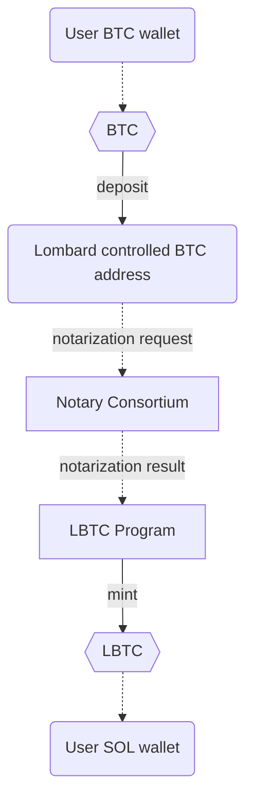
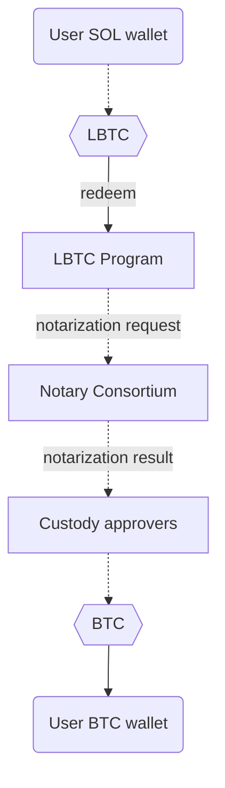

# LBTC Solana programs

[Website](https://www.lombard.finance/) | [Docs](https://docs.lombard.finance/)

## Content
1. [Overview](https://github.com/lombard-finance/sol-svm-contracts?tab=readme-ov-file#overview)
2. [One-time setup](https://github.com/lombard-finance/sol-svm-contracts?tab=readme-ov-file#one-time-setup)
3. [Audit](https://github.com/lombard-finance/sol-svm-contracts?tab=readme-ov-file#audit)

## Overview
LBTC is liquid Bitcoin; it's yield-bearing, cross-chain, and 1:1 backed by BTC. LBTC enables yield-bearing BTC to move cross-chain without fragmenting liquidity, and is designed to seamlessly integrate Bitcoin into the decentralized finance (DeFi) ecosystem while maintaining the security and integrity of the underlying asset.

| Program   | Description | Deployment                                                                                                                           |
|------------------|----------------------------------------------------------------------------------------------------------------------------------------|-|
| Bascule          | Bascule drawbridge designed to prevent bridge hacks before they hit the chain.                                                         | E1p8P6TTe8QvKmSK7QZ3n7HtQY9hE1p9JrCwLrXnPUfn |
| LBTC             | Native minting program for LBTC.                                                                                                 | LomP48F7bLbKyMRHHsDVt7wuHaUQvQnVVspjcbfuAek |
| Token | LBTC token | LBTCgU4b3wsFKsPwBn1rRZDx5DoFutM6RPiEt1TPDsY |

### BTC deposit flow
Graph below represents BTC to LBTC flow



### BTC redeem flow
Graph below represents LBTC to BTC flow


## One-time setup

Install [nodejs](https://nodejs.org/en/download/package-manager). Run node -v to check your installation.

Supports Node.js 18.x and higher.

Also, you will need to install `solana` and `anchor`. Instructions are [here](https://www.anchor-lang.com/docs/installation). Ensure you are using the same versions that are listed in the [Anchor.toml](https://github.com/lombard-finance/sol-svm-contracts/tree/main/Anchor.toml) file.

### 1. Clone this repo:
```bash
git clone https://github.com/lombard-finance/sol-svm-contracts.git
```
### 2. Install dependencies
```bash
yarn
```

### 3. Compile smart contracts

```bash
anchor build
```

### 4. Run tests

```bash
anchor test
```

## Audit

Find the latest audit reports in [docs/audit](https://github.com/lombard-finance/sol-svm-contracts/tree/main/docs/audit)


## Verify On-Chain Programs

Create a deterministic build

```bash
solana-verify build
```

get hash of built binary with

```bash
solana-verify get-executable-hash target/deploy/bascule.so
solana-verify get-executable-hash target/deploy/lbtc.so
```

compare with hash from chain

```bash
solana-verify get-program-hash <program-address>
```